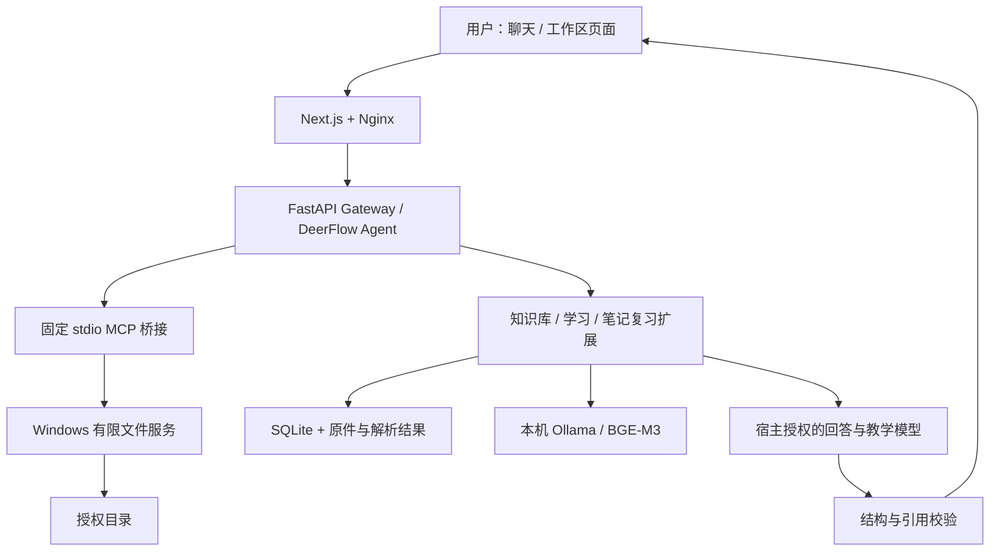

# DeerFlow Personal Assistant

基于 [DeerFlow](https://github.com/bytedance/deer-flow) 二次开发的个人任务与学习助手，通过聊天和工作区页面完成 **Windows 文件整理、资料管理、RAG 问答、学习计划、笔记入库、错题与复习**。

项目复用 DeerFlow 的聊天界面、Agent 运行时、MCP 和扩展机制，新增个人业务服务、页面与持久化流程。当前主要面向 **Windows + Docker Desktop 的本地个人使用**。

[功能介绍](#项目能做什么) · [首次启动](#首次启动windows--docker-desktop) · [日常启动与停止](#日常启动与停止) · [使用示例](#使用示例) · [详细文档](#详细文档)

## 项目能做什么

| 功能 | 具体能力 | 操作方式 |
| --- | --- | --- |
| 本地文件操作 | 查询授权目录、列出文件、新建文件夹；返回实际路径与验证状态 | 聊天调用 Windows 文件工具 |
| 文件重命名与分类 | 按前缀、后缀、编号重命名；按明确的扩展名映射分类；检查目标重名 | 聊天生成只读预览，文件整理页确认执行 |
| 执行记录与撤销 | 保存方案、版本、逐项执行状态；核对文件状态后有条件撤销 | 页面查看，聊天查询或请求撤销 |
| 个人知识库 | 创建和管理知识库；导入 PDF、Markdown、TXT；内容去重、解析状态、文档版本、更新与删除 | 知识库页面；聊天可导入明确选择的 Windows 文件 |
| RAG 问答 | 对当前有效版本建立向量索引；按选定知识库检索；生成附原文引用的回答；证据不足时拒答 | 页面建立索引和测试检索，聊天调用问答工具 |
| 学习计划与辅导 | 根据目标、已有基础、每日时间和资料范围生成章节计划；支持编辑、暂停、讲解、练习与历史记录 | 学习计划页和聊天 |
| 笔记整理与入库 | 保存手写笔记或整理历史讲解为草稿；按修订确认入库；复用同一套知识库及索引 | 学习页的笔记入口 |
| 错题与复习 | 收录错题、重练、保留原答案与新答题记录；按日期安排复习并记录自评 | 学习页的错题与复习入口 |

### 文件整理

文件操作只在操作者明确授权的 Windows 目录内执行。当前分类基于扩展名规则，不读取文件正文做语义分类。

批量操作采用“预览 → 确认具体版本 → 执行 → 查询记录”的流程，默认不覆盖文件。方案变化后旧确认失效；撤销时若文件已变化或原位置有冲突，会报告阻塞而不是强行恢复。当前不支持递归整理、跨磁盘移动或移动文件夹。

### 知识库与 RAG

知识库负责资料的导入、解析、版本和存储；RAG 在同一资料库上增加索引、检索与回答，二者共享数据。

- PDF 提取文本层和真实页码；Markdown、TXT 使用 UTF-8。
- 同一知识库按原件 SHA-256 去重，更新产生新版本。
- Ollama 在本机运行 BGE-M3，生成 1024 维向量。
- 当前使用 SQLite 保存片段和向量，Python 进行精确余弦检索；默认最多返回 6 个片段。
- 检索限定明确选择的知识库和当前有效版本；资料未完成索引时明确报错。
- 回答模型不授予执行工具。服务校验引用 ID 和版本可用性，提供受权限控制的原文链接。

单文件上限 10 MiB，PDF 上限 200 页，不支持扫描件 OCR。引用校验能检查来源有效性，不等于保证模型论点正确。

### 学习、笔记与复习

学习功能使用已导入的资料。用户提供目标、基础、每天可用时间和学习期限，系统生成章节安排、资料缺口、讲解与练习。

笔记先保存草稿，确认具体修订后才进入知识库；入库成功与索引成功分别展示。原资料更新后，相关历史笔记可保留，并显示来源可能过时。

客观题由程序判分，简答提供参考评价；阅读、作答和模型评价不会自动标记“已掌握”。复习使用明确的间隔规则，默认 1、3、7、14 天，结果由用户自评确认。当前没有自动联网收集学习资料或外部消息提醒。

## 运行架构



| 组件 | 运行位置 | 用途 |
| --- | --- | --- |
| Nginx、前端、Gateway、Redis | Docker 开发栈 | 聊天、页面、API、Agent 与上游流桥 |
| Windows 文件服务 | Windows Python 进程 | 在授权目录内执行有限文件操作 |
| Ollama / BGE-M3 | Windows 本机 | 文档和问题向量化 |
| 回答与教学模型 | 由 `config.yaml` 配置 | 聊天、证据问答与学习内容生成 |

**Docker 可以启动应用，但不会自动启动 Windows 文件服务和 Ollama。** Windows 授权目录不挂入容器，由独立文件服务访问。BGE-M3 负责向量化，不是回答模型；回答模型可以使用已配置的兼容服务。若回答模型在远程运行，命中片段会发送到该服务。

## 首次启动：Windows + Docker Desktop

下面使用 PowerShell，所有命令从仓库根目录执行。已有配置的用户直接查看[日常启动与停止](#日常启动与停止)，不要重新生成配置或令牌。

### 1. 准备环境

必需：

- Git。
- Windows Python 3.12 或更高版本，可通过 `python --version` 检查。
- Docker Desktop，运行 Linux 容器；Docker Compose 2.24 或更高版本。
- 本机 Ollama 和 BGE-M3，用于 RAG。
- 一个能够用于聊天和工具调用的模型服务，以及对应凭据。

Docker 构建会安装容器内的 Python、Node.js 和前后端依赖。仅按本节启动时，不要求宿主机额外安装 Node.js、pnpm 或 uv；在宿主机开发和测试时才需要相应工具。

```powershell
git clone https://github.com/elaisaka/deer-flow.git
Set-Location deer-flow

python --version
docker version
docker compose version
```

### 2. 创建私有配置并配置聊天模型

仅复制不存在的文件，保留已有配置：

```powershell
if (-not (Test-Path config.yaml)) {
    Copy-Item config.example.yaml config.yaml
}
if (-not (Test-Path extensions_config.json)) {
    Copy-Item extensions_config.example.json extensions_config.json
}
if (-not (Test-Path .env)) {
    Copy-Item .env.example .env
}
if (-not (Test-Path frontend/.env)) {
    Copy-Item frontend/.env.example frontend/.env
}
New-Item -ItemType Directory -Path logs -Force | Out-Null
```

在根目录 `.env` 中添加以下变量，**把占位值替换为实际服务信息**：

```dotenv
PERSONAL_CHAT_API_KEY=replace-with-your-api-key
PERSONAL_CHAT_BASE_URL=https://your-provider.example/v1
PERSONAL_CHAT_MODEL=replace-with-your-chat-model-id
```

编辑 `config.yaml` 中已有的 `models:` 列表。下面是 OpenAI 兼容服务的配置形式，不能重复创建第二个顶层 `models:`：

```yaml
models:
  - name: personal-chat
    display_name: Personal Chat
    use: langchain_openai:ChatOpenAI
    model: $PERSONAL_CHAT_MODEL
    base_url: $PERSONAL_CHAT_BASE_URL
    api_key: $PERSONAL_CHAT_API_KEY
```

`name` 是项目内部使用的名称，`model` 是服务提供方的模型 ID。后续插件授权使用 `personal-chat`。其他模型类型和参数见[后端配置说明](backend/docs/CONFIGURATION.md)。

保持默认登录认证。文件执行确认、资料更新删除、笔记入库需要管理员浏览器会话，不能通过 `DEER_FLOW_AUTH_DISABLED` 绕过。首次启动后在页面创建管理员账户。

### 3. 初始化 Windows 文件服务

建立独立虚拟环境：

```powershell
python -m venv .local-file-service/venv
$taskPython = Join-Path $PWD.Path '.local-file-service/venv/Scripts/python.exe'
& $taskPython -m pip install -r services/local_file_service/requirements.txt
```

下面创建专用资料目录作为示例。也可以换成自己明确授权的已有目录；不要把整个用户目录、磁盘或服务私有配置目录作为授权根。

```powershell
$taskAuthorizedRoot = Join-Path $env:USERPROFILE 'DeerFlowData'
New-Item -ItemType Directory -Path $taskAuthorizedRoot -Force | Out-Null

& $taskPython -m services.local_file_service.configure `
  --root $taskAuthorizedRoot --root-id study

& $taskPython -m services.local_file_service.configure_organization
```

第二个命令生成文件整理的运行配置、操作客户端配置、MCP 注册配置和确认密钥，默认保存在：

```text
%LOCALAPPDATA%/DeerFlow/local-files-phase2/
├── service-config.json
├── approval-client.json
├── mcp-server.json
└── approval-code.txt
```

确认密钥保留在 Windows 的项目与授权目录之外，仅在文件整理确认页使用。初始化命令遇到已有配置会拒绝覆盖，这是预期行为；不要删除旧配置来重跑。

### 4. 准备本地 embedding

安装并启动 Windows Ollama，然后下载模型：

```powershell
ollama pull bge-m3
ollama list
```

若 Ollama 未运行，可在独立终端执行 `ollama serve`；已有服务运行时不必再启动一个实例。

检查本机响应：

```powershell
$taskProbe = Invoke-RestMethod -Method Post `
  -Uri http://localhost:11434/api/embed `
  -ContentType application/json `
  -Body '{"model":"bge-m3","input":["个人学习助手连通测试"],"truncate":false}'

[pscustomobject]@{
    Model = $taskProbe.model
    Dimension = $taskProbe.embeddings[0].Count
}
```

应返回 `bge-m3` 和 `1024`。Docker 内通过 `host.docker.internal:11434` 连接该服务；本机响应正常并不等于 Docker 已连通，首次建立真实索引时还需要核对。

### 5. 启用两个个人扩展

在 `config.yaml` 的顶层合并下面的 `plugins:` 配置。若已有插件，只追加这两个条目，保留其他条目；不要产生第二个 `plugins:`。

```yaml
plugins:
  - use: file_organization_extension:install
    enabled: true
    required: true
    config:
      enabled: true
      credentials_path: /run/deerflow-local-files/approval-client.json
      origins: [http://localhost:2026, http://127.0.0.1:2026]

  - use: knowledge_base_extension:install
    enabled: true
    required: true
    host_access:
      model_invocation:
        roles:
          default: personal-chat
        max_concurrency: 1
        timeout_seconds: 20
        max_input_chars: 32768
        max_output_chars: 24000
    config:
      enabled: true
      data_dir: /var/lib/deerflow-knowledge
      parser_dependencies: /var/lib/deerflow-knowledge/python
      credentials_path: /run/deerflow-local-files/approval-client.json
      origins: [http://localhost:2026, http://127.0.0.1:2026]
      rag:
        embedding:
          provider: ollama
          url: http://host.docker.internal:11434/api/embed
          model: bge-m3
          dimension: 1024
          allow_send: true
          timeout: 20
          retries: 1
        index:
          chunk_chars: 1200
          overlap: 150
          top_k: 6
          context_chars: 8000
          min_score: 0.25
          max_candidates: 10000
```

`host_access` 与 `config` 同级；`default` 必须对应 `models[].name`。学习、笔记、错题和复习由同一个知识扩展注册，无需再添加插件或数据库。

上述 `allow_send: true` 表示允许将所选资料片段发送到配置的 embedding 端点。示例端点是本机 Ollama；回答阶段是否使用远程服务由聊天模型配置决定。

### 6. 启动 Windows 文件服务

在第一个 PowerShell 终端，从仓库根目录执行并保持运行：

```powershell
$taskPython = Join-Path $PWD.Path '.local-file-service/venv/Scripts/python.exe'
$taskPrivate = Join-Path $env:LOCALAPPDATA 'DeerFlow/local-files-phase2'

& $taskPython -m services.local_file_service.server `
  --config (Join-Path $taskPrivate 'service-config.json')
```

默认端口为 `8765`。需要停止时在此终端按 Ctrl+C。

### 7. 启动 Docker 开发栈

在第二个 PowerShell 终端进入同一个仓库，设置路径并使用四份 Compose 文件：

```powershell
$env:DEER_FLOW_ROOT = $PWD.Path.Replace('\', '/')
$env:FILE_ORGANIZATION_PRIVATE_DIR = `
  (Join-Path $env:LOCALAPPDATA 'DeerFlow/local-files-phase2').Replace('\', '/')

$taskCompose = @(
    '-p', 'deer-flow-dev',
    '--env-file', '.env',
    '-f', 'docker/docker-compose-dev.yaml',
    '-f', 'docker/docker-compose.local-files.yaml',
    '-f', 'docker/docker-compose.file-organization.yaml',
    '-f', 'docker/docker-compose.knowledge-base.yaml'
)

docker compose @taskCompose config --quiet
if ($LASTEXITCODE -ne 0) { throw 'Compose 配置检查失败，请先修正配置。' }

docker compose @taskCompose up -d --build
docker compose @taskCompose ps
```

首次构建需要下载镜像和依赖。上面三个 overlay 分别提供 MCP 桥接代码、文件整理扩展与操作客户端配置、知识库扩展与持久数据卷。

检查 Gateway 就绪状态：

```powershell
docker exec deer-flow-gateway /app/backend/.venv/bin/python -c `
  "import urllib.request; print(urllib.request.urlopen('http://127.0.0.1:8001/health/ready',timeout=5).status)"
```

启动期间若暂未就绪，等待后重试；持续失败时查看仓库 `logs/gateway.log` 和 Compose 状态。开发入口脚本将 Gateway、前端日志写入 `logs/`，容器日志不一定包含完整应用日志。

### 8. 安装知识库解析依赖并注册 MCP

Gateway 启动后，首次安装独立解析依赖，再重启 Gateway：

```powershell
docker exec deer-flow-gateway uv pip install `
  --target /var/lib/deerflow-knowledge/python `
  -r /app/backend/knowledge_base_extension/requirements.txt

docker restart deer-flow-gateway
```

依赖存放在知识库数据卷内；已有环境无需每次重复安装。重启后再次检查上一节的就绪接口。

首次注册 Windows MCP 工具，并检查桥接连通性：

```powershell
$taskPython = Join-Path $PWD.Path '.local-file-service/venv/Scripts/python.exe'
$taskPrivate = Join-Path $env:LOCALAPPDATA 'DeerFlow/local-files-phase2'
$taskEntry = Join-Path $taskPrivate 'mcp-server.json'

& $taskPython -m services.local_file_service.register --entry $taskEntry
& $taskPython -m services.local_file_service.verify --entry $taskEntry
```

注册只合并 `windows-local-files`，不替换其他 MCP 配置。若该条目已存在，注册命令拒绝重复写入；已有用户无需重复注册。

### 9. 登录并检查功能

打开 **[http://localhost:2026](http://localhost:2026)**。首次根据页面提示创建管理员账户，登录后进入：

| 页面 | 地址 |
| --- | --- |
| 聊天 | [新建聊天](http://localhost:2026/workspace/chats/new) |
| 文件整理 | [方案预览与执行确认](http://localhost:2026/workspace/extensions/personal.file-organization/plans) |
| 个人知识库 | [资料、版本与索引](http://localhost:2026/workspace/extensions/personal.knowledge-base/library) |
| 学习计划 | [计划、笔记、错题与复习](http://localhost:2026/workspace/extensions/personal.learning/study) |

在新聊天中查询授权目录，核对 `study` 指向自己设置的 Windows 路径。知识库内上传一份 UTF-8 TXT 或 Markdown，确认解析成功，再点击“索引当前版本”，等索引 ready 后测试问答。

**页面能打开、解析 ready、索引 ready 是三个不同检查点。** 页面的选库不会自动设置聊天范围，聊天中要明确知识库名称或 ID。

## 日常启动与停止

保留首次生成的配置、令牌、账本和数据卷：

1. 打开 Docker Desktop，确认本机 Ollama 正在运行。
2. 从仓库根目录执行首次启动第 6 节的 Windows 服务命令。
3. 在另一个终端设置第 7 节的环境变量和 `$taskCompose` 数组，执行：

```powershell
docker compose @taskCompose up -d
```

代码变化需要重新构建时使用 `up -d --build`。插件配置、模型授权或扩展静态资源变化后重启 Gateway；Windows 服务代码或授权根变化后重启 Windows 服务。修改根目录 `.env` 的模型凭据后，需要重新创建 Gateway 容器，使新环境变量生效。

停止前结束正在进行的文件执行、索引或生成任务：

```powershell
docker compose @taskCompose stop
```

Windows 服务终端按 Ctrl+C。不要使用 `down -v` 作为普通停止命令，它会删除 Docker 数据卷。下次使用相同项目名、Compose 文件和配置启动。

## 使用示例

### 新建文件夹

在聊天中输入：

```text
请先查询 Windows 授权目录，然后在 study 根目录下创建 test-folder。
只使用本地文件工具，返回实际路径和验证结果。
```

重复请求应返回 `already_exists`；服务断开时应报告连接失败及结果未验证。

### 文件分类与撤销

先在授权目录中准备普通测试文件，确保不是正在使用的真实资料：

```text
只处理 study 中 organize-demo 目录下的 sample.txt、note.md、paper.pdf。
按 .txt→Text、.md→Notes、.pdf→PDF 分类。
先生成预览，等待我在文件整理页面确认，不要使用 Shell。
```

在文件整理页核对源/目标路径、方案版本和冲突，输入 Windows 私有目录中的确认密钥并执行。之后可在聊天中请求查询方案记录或撤销该方案；撤销依赖当前文件状态。

### 根据资料问答

先在知识库页创建“Redis 学习资料”，导入自己的资料并完成索引：

```text
仅使用个人知识库中的“Redis 学习资料”，先检查索引状态，
再调用 knowledge_answer 解释 RDB 和 AOF 的区别。
展示工具返回的回答和原文引用；资料不足时明确说明。
```

### 制定学习计划

```text
我会 Java 基础，还没有系统学习 Redis。
请基于“Redis 学习资料”制定 14 天学习计划，每天 30 分钟，
目标是理解常见数据类型、持久化和基础使用。
标明资料覆盖不到的内容，先展示计划。
```

计划保存后，可在学习页调整章节、开始学习、生成讲解和练习。学习进度由用户明确标记。

### 笔记与错题复习

在学习页选择一份已有讲解，生成笔记草稿，修改并保存；核对目标知识库和草稿修订后，点击确认入库，再为新文档版本建立索引。

练习后查看反馈，按需要收录错题、发起重练，在复习页查看到期对象并提交自评。重练保留原答题记录，不自动改变章节完成状态。

## 数据保存位置

| 数据 | 默认位置 |
| --- | --- |
| 主配置与模型凭据 | 仓库根的 `config.yaml`、`extensions_config.json`、`.env`，均为私有文件 |
| Windows 虚拟环境与初始配置 | 仓库 `.local-file-service/` |
| Windows 运行配置、确认密钥和整理账本 | `%LOCALAPPDATA%/DeerFlow/local-files-phase2/`；账本在其 `organization/` 下 |
| Windows 原文件 | 操作者配置的授权目录 |
| 知识库原件副本、解析内容、向量及学习记录 | Docker 卷 `deer-flow-dev_knowledge-base-data`，容器路径 `/var/lib/deerflow-knowledge` |
| 知识库数据库 | 上述路径的 `knowledge.sqlite3` |
| 文档原件与解析结果 | `objects/<version_id>/original`、`objects/<version_id>/parsed.json` |
| 上游聊天运行数据 | 开发栈 `backend/.deer-flow/`，按宿主生命周期管理 |
| 运行日志 | 仓库 `logs/` |

知识库保存的是导入副本。删除知识库资料不会删除 Windows 原文件，也不会清除独立保留的聊天、学习历史或备份。备份知识库时需一起保存 SQLite 和 objects，并先停止写入；具体操作见[备份与恢复手册](docs/DEMO.md#数据备份和独立恢复)。

## 常见问题

| 现象 | 检查与处理 |
| --- | --- |
| Docker 启动了，但不能操作 Windows 文件 | 检查 Windows 服务是否启动、MCP 是否注册、私有目录是否与 overlay 一致；运行 MCP 连通检查 |
| 能导入资料，但问答提示索引未完成 | 解析成功不等于已索引；逐篇建立当前版本索引，查看实际错误和进度 |
| `embedding_not_configured` 或连接失败 | 检查 Ollama、BGE-M3、模型维度、`allow_send` 和 Docker 到宿主机的连通性 |
| `answer_model_not_granted` | 检查知识扩展的 `host_access.model_invocation.roles.default` 是否匹配 `models[].name` |
| 文件执行或笔记入库无法确认 | 使用管理员浏览器登录、相同入口来源和有效预览；文件整理还需要 Windows 确认密钥 |
| PDF 无有效文本或解析失败 | 检查依赖、大小、加密或损坏状态；扫描件需要先在其他工具中 OCR |
| 文件重名或撤销受阻 | 核对目标路径和文件变化，不通过覆盖或 Shell 绕过检查 |
| 聊天没有使用指定资料 | 新建聊天，明确库名称/ID并要求调用个人知识库工具；页面选库不自动传给聊天 |
| 生成超时或结构错误 | 保留失败状态，检查模型服务和授权，缩小生成范围后重试；失败不算生成成功 |

默认示例统一使用 `http://localhost:2026`。若更改端口或域名，需要同步扩展 `origins` 和宿主相关来源配置。默认 Windows loopback 到 Docker 的连通性取决于 Docker Desktop 环境；遇到问题按[本地文件服务指南](docs/LOCAL_FILE_SERVICE.md)排查。

## 代码入口与技术栈

| 模块 | 路径 |
| --- | --- |
| Windows 文件服务及 MCP 桥接 | `services/local_file_service/` |
| 文件整理确认页面与接口 | `backend/file_organization_extension/` |
| 文档存储与解析 | `backend/knowledge_base_extension/store.py`、`parser.py` |
| 向量检索与证据问答 | `backend/knowledge_base_extension/rag.py`、`answer.py` |
| 学习计划与反馈 | `backend/knowledge_base_extension/learning.py`、`feedback.py` |
| 笔记、错题与复习 | `backend/knowledge_base_extension/study.py` |
| 个人扩展页面 | `backend/knowledge_base_extension/static/` |
| 宿主前端和 Gateway | `frontend/`、`backend/app/` |

个人模块主要使用 **Python、FastAPI、MCP、SQLite、JavaScript、Ollama、BGE-M3、Docker、pytest**。宿主框架使用 **LangGraph、Next.js、React、TypeScript**；Redis 用于上游运行时流桥，个人知识和学习数据存储在 SQLite。

## 验证与当前范围

已记录专项自动回归、开发栈真实聊天与页面操作、索引与引用、更新删除、重启持久化，以及专用合成数据上的备份恢复。结果和失败记录见[验收矩阵](docs/ACCEPTANCE.md)与[收尾记录](docs/CLOSEOUT.md)。

- 当前面向本地个人使用，生产部署和长期容量尚未独立验收。
- 问答引用和生成结构校验不保证语义正确；简答反馈需核对。
- 当前检索为精确向量基线，没有混合检索、重排或跨设备同步。
- 个人扩展未实现 OCR、自动联网采集、外部通知或任意桌面自动化。上游通用工具能力与个人资料入库流程分别管理。
- Windows symlink 的部分实机测试受权限限制，junction 越界检查已有回归记录。
- 自动测试、真实服务测试、代理验收和真人评分分别记录，不相互替代。

本 README 不包含未发布的本地评测数据或其结果。复测命令与各阶段历史结果保留在下面的详细指南中。

## 详细文档

| 文档 | 内容 |
| --- | --- |
| [项目目标与范围](docs/PROJECT_SCOPE.md) | 已实现能力、约束和阶段记录 |
| [个人模块架构](docs/PERSONAL_ASSISTANT_ARCHITECTURE.md) | 贡献边界、模块关系、数据与信任边界 |
| [Windows 文件服务](docs/LOCAL_FILE_SERVICE.md) | 配置、连接、工具及排查 |
| [文件整理](docs/FILE_ORGANIZATION.md) | 预览、确认、执行、撤销和验收 |
| [知识库管理](docs/KNOWLEDGE_BASE.md) | 导入、解析、版本与删除 |
| [RAG 问答](docs/RAG.md) | embedding、索引、检索、引用及模型授权 |
| [学习计划](docs/LEARNING.md) | 章节、讲解、练习与反馈 |
| [笔记、错题与复习](docs/NOTES_AND_REVIEW.md) | 草稿入库、重练、复习与来源关系 |
| [合成 Demo 与运行手册](docs/DEMO.md) | 示例资料、完整操作、备份与恢复 |
| [当前验收矩阵](docs/ACCEPTANCE.md) | 自动验证、服务验收与未完成项 |
| [收尾结果](docs/CLOSEOUT.md) | 后续补验及已知模型问题 |
| [上游宿主配置](backend/docs/CONFIGURATION.md) | 模型、沙箱及通用配置 |
| [认证设计](backend/docs/AUTH_DESIGN.md) | 登录、管理员、来源与 CSRF |
| [贡献指南](CONTRIBUTING.md) | 通用开发规范 |

## 开源来源与许可

本项目基于 [ByteDance DeerFlow](https://github.com/bytedance/deer-flow)，保留上游版权、Git 历史和 [MIT 许可证](LICENSE)。

新增工作主要是个人业务扩展、Windows 执行服务和跨模块联动。聊天、Agent 核心运行时、通用 MCP 与宿主工作区来自上游；宿主修复涉及内部模型输出隔离等通用问题，不将上游框架能力计为本项目从零实现。
