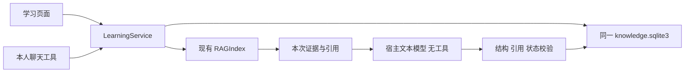

# 第 5 阶段：学习计划与辅导

2026-10-05：学习服务、独立页面与聊天工具在现有知识扩展中实现，共享一套知识库、
SQLite、RAG、引用和模型授权。自动验证见文末；真实模型开发栈已部分验收，完整
真人闭环按文末逐项记录，未完成部分不能算通过。
第 6 阶段的笔记入库、错题本、间隔复习和通知未开发，答题仅保存为学习记录。

## 架构、身份与数据模型

选择扩展现有 `knowledge_base_extension`，增加 `learning.py` 和 `learning_models.py`。
KnowledgeService 已持有所有权 store、RAGIndex 与无工具 ModelInvoker，学习服务
直接复用它们；新的 `personal.learning` 使用独立静态资源。不复制资料、索引或管理
逻辑，也不改 Agent 循环。仅补通用 ToolContext 的可选 run_id 与 user_text 字段。



页面沿用插件动作、viewer 绑定、权限与 CSRF；服务另要求个人管理员，拒绝匿名/
内部身份。工具来自宿主可信 run user，不要求浏览器管理员标记。所有 ID 按本人
所有权检查，schema 不接受 user_id。user_text 从最后一条 HumanMessage 投影，
最多 16,000 字符，优先 original_user_content 排除上传资料展开；不是模型参数。

全部表在原卷 `knowledge.sqlite3`，复用 store 的进程/OS 锁、BEGIN IMMEDIATE 与
完整事务；既有知识表不改。结构化 JSON 经有界 schema 和服务校验后保存。

| 表 | 内容 |
| --- | --- |
| learning_plans | owner、稳定 ID、输入、修订、状态、章节顺序/目标/知识点、结构化进度、缺口、预算、来源定位 |
| learning_revisions | 编辑前完整快照，plan_id/revision 唯一 |
| learning_lessons | 不可变讲解、题目、私有答案/rubric、章节快照、生成时间、计划修订、retrieval/文档版本/chunk/引用定位 |
| learning_attempts | 每次用户答案、规则分数或参考评价、反馈、知识点、题目/讲解、来源版本、聊天答案来源摘要 |
| learning_receipts | owner/request_id 唯一，请求摘要、60 秒租约/token、结果 ID，与业务写入原子提交 |
| learning_events | 动作、修订、时间、宿主 thread/run；页面无聊天时关联为 null |

计划 active ↔ paused；章节 pending → in_progress → completed。completed 仅代表
用户点击“我已完成本章节”，completion_basis 是 user_marked_done_not_mastery。
讲解、判分、看过页面都不会标记完成/掌握。每次修改增加修订；无模型编辑、完成、
确认变化或掌握工具。返回实际结构化状态，不用另一个模型猜测数据库更新成功。

记录独立于聊天生命周期：关闭页面、新开聊天、重启都从 SQLite 找回；删除/归档
聊天不删学习数据，thread/run 只是来源关系。页面不伪造 run ID。

## 输入、覆盖和时间预算

必填主题、具体目标、已有基础（可明确填“没有基础”）、每天 5–480 分钟、明确
选定 1–10 个知识库，以及总天数/目标日期二选一。天数 1–365；目标日期以用户
时区计算，包含起始日和目标日。默认 Asia/Shanghai，约束默认空列表。关键条件
缺失时要求填写/询问，不编造基础。页面明确展示默认时区。

先实际检索主题与目标。模型只收到用户输入和本次有界证据，资料指令为低权限
数据，模型没有操作工具。章节引用只能来自这次证据；无引用必须 supplemental=true，
页面区分“建议补充”。缺口持久保存；零证据可以生成全补充计划，但不能伪装成
资料已覆盖，也不能无证据讲解。这是 top-k 检索覆盖，不是穷尽整库或正确性认证。

最多 40 章、单文本 1,500 字符、标题 200，计划整体最多 28,000 UTF-8 字节。
模型结构和引用由服务再校验；schema 展开为 inline 形式，符合宿主禁止 $ref 的
合同。每次生成的 schema 进一步枚举本次 citation_id，练习知识点枚举章节原值；
讲解需求不发送计划的旧 citation_ids。服务仍独立校验，不放宽证据/知识点检查。
非法输出、超时、缺授权不发布看似可用的计划。

按顺序把完整章节装入每日预算，预计分钟含练习。超过每日时间时拒绝并要求拆分；
安排超出总期限时保留可查看计划并明确 over_budget 提示。估计不承诺按期掌握。

## 编辑、版本与请求恢复

编辑支持顺序、章节内容/时间、移出、添加补充章，以及 time_budget 的总天数与
每天分钟。总天数从原 start_date 计算；更换整体基础/目标/知识库请另建计划，
原计划仍保留。携带 expected_revision，旧修订拒绝并要求刷新。

移出章转 archived_chapters，进度、历史讲解和答题不删除。进行中/已完成章的
名称、目标、知识点、资料关联或支持属性变化时，保存 before/after，置
needs_confirmation，页面展示并要求用户亲自核对。多次编辑不丢待确认变化。
旧完成标记不重置；单纯顺序/时长变化不使旧题失效。实质变化后的旧题拒绝新提交，
需重新开始取得新题；确认不会改写历史讲解。

修改必须携带 32 位十六进制 request_id。同请求复用持久结果；同 key 不同参数
拒绝，处理中重复返回 in_progress。失败释放租约，不保存可用计划/讲解/答题；
重启后遗留未完成租约最多 60 秒过期，旧 token 不能提交。

检索/模型在事务外，提交复核修订、状态、当前版本/tombstone。生成整体最多
27 秒，检索 embedding 8 秒、模型请求 18 秒，仍受宿主授权进一步限制。检索线程
被取消后可能留下无正文收据，但不能发布课程。已开始的短提交事务不因响应丢失
假装回滚：写入与结果收据原子保存，以同 key 重试查真实结果。

## 讲解、练习与反馈

明确 plan_id/chapter_id 开始，再实际检索章节目标；计划文字只作查询需求，绝不
当证据。讲解有目标、概念、例子、简短检查题，资料引用来自本次 retrieval。
无证据、范围未索引/失败、资料期间变化时明确失败。explain 接受“没看懂”的
具体问题，重新检索并保存补充讲解，原讲解保持不可变。

每讲解 2–4 题，同时支持客观题和简答题，保存知识点、来源版本、参考答案与
rubric。lesson 普通页面/工具响应移除 answer/rubric，没有正确选项标记；宿主
第 4 阶段内部模型隔离隐藏原始结构和错误流。模型参考答案质量仍需人工核对。

客观题必须精确选择某一选项，程序判 0/1。简答使用 `feedback.py` 的 v2 核对合同：
模型逐条返回学生原句、supported/contradicted/missing/uncertain、具体差异和引用。
服务验证原句是实际答案的连续子串，证据引文确属当前引用；不允许把参考答案当学生
答案。第二次独立模型复核原始答案和证据，针对主体/特征颠倒等错误挑战初评。
任一轮矛盾/遗漏不能被另一轮正面评价消除；程序汇总为 satisfactory / needs_work /
insufficient_evidence，不接受模型的自由文本总体“正确”结论。两次各 8 秒，仍受
整体 27 秒限制；可能增加延迟、调用费用和超时率，不承诺语义判定始终正确。

score 恒为 null、reference_evaluation=true、grading_version=2。保存有界核对记录
（学生原句、差异与定位），核验所用 evidence_quote 只在内存中处理，不保存/公开。
证据不足不强制评分；任一轮失败/超时或引文核验失败不写 attempt，也不算答题成功。
来源失效拒绝新判分；不自动写知识库。旧版评价历史不改写，读取时明确显示“可能
误判、请重新作答复核”的 evaluation_notice，不把旧评价当作当前已确认结论。

聊天 submit 必须匹配宿主当前人类消息的如下格式，逐字比对答案和题目 ID，
不接受模型自称用户已作答。没有格式、没有 run 或模型改写答案，返回
learning_human_answer_required。同 run/讲解/题目/答案即使重试换 key，也只一条记录。
页面用户直接填写答案，不需要聊天协议。

```text
学习作答 <工具实际返回的 exercise_id>
答案：<你亲自填写的答案，可多行>
结束作答
```

## 历史、引用失效和删除

学习来源只保存 ID/版本/chunk/定位，不另存原文 excerpt。原文仍走现有认证引用
入口，检查所有权和当前版本。读取学习记录实时显示 valid、updated、
deleted_or_unavailable 或 unavailable，资料变化标记 possibly_outdated。
删除后新接口不能读原文，来源投影不再展示被删除文档名；讲解、评分不悄悄改写，
章节不自动重置。

**历史讲解、题目、用户答案及反馈可能含原资料摘录或转述，仍向本人保留。** 资料删除
不等于擦除学习历史；也不清除既有 DeerFlow ToolMessage/聊天回答、下载及备份。
创建/查看页和知识库删除预览均提示此策略。聊天需用户另行删除，备份单独清理。
无新的原文下载或私有答案导出接口。当前无学习历史删除页/TTL；若需整体清理，
停 Gateway 后按私有数据管理策略清理整个资料卷及备份，会包含知识与学习数据。
日常重启不能使用 down -v。

## 配置、启动和体验

已有知识扩展无需新增 plugins 条目或第二 data_dir，同一安装贡献知识和学习两个
命名空间；RAG embedding allow_send 与 host_access.model_invocation 授权保持复用。
示例及数据发送许可见 [RAG.md](RAG.md)，解析依赖见 [KNOWLEDGE_BASE.md](KNOWLEDGE_BASE.md)。
学习模型发送本次证据、用户基础目标；简答还发送题目/评分依据及用户答案，沿用
原服务的数据发送和计费政策，不读取其他库或自动联网。

原模型授权可使用 max_input_chars: 32768、max_output_chars: 24000、
timeout_seconds: 20；学习仍请求最多 18 秒。大/慢输出可能失败，应缩小章节和文本，
不能算成功。不要输出或提交私有配置/凭据。

代码、工具合同和静态资源更新后必须重启 Gateway，浏览器 Ctrl+F5。首轮 Docker
未运行；用户随后启动 Docker，已完成开发栈健康检查及修复后的 Gateway 重启。
完整真人学习闭环仍须按文末记录验收。之后沿用原开发栈参数及资料卷：

```powershell
Set-Location E:\111\deer-flow
$env:DEER_FLOW_ROOT = $PWD.Path.Replace('\','/')
$env:FILE_ORGANIZATION_PRIVATE_DIR = (Join-Path $env:LOCALAPPDATA 'DeerFlow/local-files-phase2').Replace('\','/')
docker compose -p deer-flow-dev --env-file .env `
  -f docker/docker-compose-dev.yaml -f docker/docker-compose.local-files.yaml `
  -f docker/docker-compose.file-organization.yaml -f docker/docker-compose.knowledge-base.yaml `
  up -d --no-deps --no-build gateway
docker restart deer-flow-gateway
```

首次起栈先按知识库指南启动依赖；不要同步 Windows 测试环境到 Docker，不执行
down -v。禁用原知识插件会同时停止知识/学习入口，数据保留；无运行时业务开关 API。

页面：[学习计划](http://localhost:2026/workspace/extensions/personal.learning/study)。
左侧计划、右侧章节/练习，继承宿主主题，窄屏上下排列，literal DOM 渲染，异步
按计划/视图序列隔离，退出 dispose。页面选库不自动设置聊天范围。

## 同一业务动作和可复制聊天

`POST /api/plugins/personal.learning/actions/<action>`：

| 动作 | 参数 |
| --- | --- |
| bases / list | 无；库列表 / 本人最近 50 计划摘要 |
| create | request_id,input（完整输入） |
| get | plan_id；实际进度、最近 20 条历史摘要 |
| edit | request_id,plan_id,expected_revision,chapters，可选 time_budget={days,daily_minutes} |
| start / explain | request_id,plan_id,chapter_id；explain 另需 question |
| lesson / attempt | plan_id,lesson_id / plan_id,attempt_id；本人单条历史 |
| history | plan_id,kind=lessons/attempts,offset；20 条/页，next_offset |
| submit | request_id,plan_id,lesson_id,exercise_id,answer；模型另验 human 协议 |
| pause / resume | request_id,plan_id,expected_revision |
| complete / confirm_change | request_id,plan_id,chapter_id,expected_revision；只页面动作 |

历史 offset 是实时分页，新增记录可能移动页边界，全部记录仍在数据库可按 ID 查。
工具为 learning_create/list/get/start/explain/lesson/attempt/history/submit，宿主加
命名空间前缀。没有普通参考答案查询或模型掌握工具。

```text
我会 Java，想用两周学习 Redis，每天 30 分钟。请使用知识库工具找到我明确选择的
“Redis-学习-合成”并检查索引，用 learning_create 制定计划。目标是理解持久化与
恢复演练，时区 Asia/Shanghai。展示资料缺口、时间安排和真实 plan_id/chapter_id，
不承诺掌握。随后对明确返回的第一章使用 learning_start，返回讲解、原文引用和
练习 ID。不要替我答题，也不操作本地文件。
```

```text
请 learning_list 查询我的计划，对我选中的 <plan_id> 用 learning_get 查询实际
进度，告诉我当前章节和待核对变化，不凭聊天记忆猜测。
```

```text
请对我的 <plan_id>、<chapter_id> 用 learning_explain：刚才恢复例子没看懂，
请基于实际资料补充解释，不用计划文字充当证据。
```

答题前获取实际 exercise_id，再发前述“学习作答”协议。暂停、继续、章节变化确认、
完成标记请在页面亲自操作，Agent 不代点击、不宣称掌握。

## 自动验证与真人验收

自动测试使用临时 SQLite、合成资料、可控 embedding/模型，实际执行 RAGIndex、
ToolNode、宿主 inline schema 子进程和页面权限。覆盖输入/时区、预算/缺口、非法
结构/失败/超时、重复请求、修订冲突/历史保留、重建 store 恢复、跨用户/错误身份/
页面拒绝、本次证据、更新/删除/引用、私有答案、两类判分、人类答案来源与无自动入库。

独立 Windows 测试环境为 `.deer-flow/learning-dev-venv`，uv.lock 安装；原
backend/.venv 是 Linux 环境。私有配置包含 Docker 路径，离线门禁显式用公开示例：

```powershell
Set-Location E:\111\deer-flow\backend
$env:PYTHONPATH = '.'
$env:PYTHONUTF8 = '1'
$env:DEER_FLOW_CONFIG_PATH = 'E:/111/deer-flow/config.example.yaml'
$env:UV_PROJECT_ENVIRONMENT = 'E:/111/deer-flow/.deer-flow/learning-dev-venv'
& C:/Users/lenovo/.local/bin/uv.exe sync --locked
& ../.deer-flow/learning-dev-venv/Scripts/python.exe -m pytest tests/test_learning.py tests/test_personal_rag.py tests/test_knowledge_base.py tests/test_knowledge_extension.py tests/test_plugin_tools.py tests/test_agent_guidance_check.py tests/test_extension_model_invocation.py -q
& ../.deer-flow/learning-dev-venv/Scripts/python.exe -m pytest -m 'not live' --ignore=tests/blocking_io tests/ -q
& ../.deer-flow/learning-dev-venv/Scripts/python.exe -m pytest tests/blocking_io -q
& ../.deer-flow/learning-dev-venv/Scripts/python.exe -m ruff check .
& ../.deer-flow/learning-dev-venv/Scripts/python.exe -m ruff format --check .
Set-Location ../frontend
corepack pnpm check
corepack pnpm test run
node --test tests/learning-ui.test.mjs tests/knowledge-library-ui.test.mjs
Set-Location ..
python scripts/check_agent_guidance.py
git diff --check
```

已核对阶段 4 `ac0cd096` 的 [unit CI](https://github.com/elaisaka/deer-flow/actions/runs/37209895018)、
[blocking-io](https://github.com/elaisaka/deer-flow/actions/runs/37209895035)、
[lint](https://github.com/elaisaka/deer-flow/actions/runs/37209895055)、前端及 guidance 等成功。
本阶段未提交，无本阶段远端 CI；先前文档中的失败记录属于当时历史，不代替新验证。

本轮验证结果（2026-10-05），日志在忽略目录 `.deer-flow/learning-*.log`：

| 检查 | 结果 |
| --- | --- |
| 学习专项 | 首轮 27 项；当前含引用合同及简答核对回归，30 passed（最后一次单独复跑 12.13s） |
| 学习 + 第 3/4 阶段知识/RAG + 通用工具/模型/guidance 回归 | 首轮 155 passed；引用修复后各 156；简答核对修复后 Windows 与 Docker Linux 各 158 passed |
| Windows 本地文件/整理服务回归 | 77 passed、3 skipped；使用独立原生服务环境，从仓库根运行 |
| 学习页面 + 既有知识页面 DOM 测试 | 首轮 14 passed；新增答题后修订刷新/草稿保留回归后 15 passed |
| 全前端 eslint/tsc；全前端单测 | check 成功；2258 passed |
| 后端全量 ruff check / format | 成功；1823 个文件格式通过 |
| 本次新增 JS/CSS/manifest/页面测试 Prettier；git diff --check | 成功 |
| guidance | 39 个指南、0 errors、1 AG002 软警告；strict-warnings 未通过 |
| 公开配置全后端 offline 最终复跑 | 22855 passed、240 failed、2 errors、832 skipped、7 deselected；未通过 |
| 公开配置 blocking-io 最终复跑 | 190 passed、17 failed、3 skipped；未通过 |

全后端复跑期间新增的最后 4 项学习测试另经专项通过，不将它们计入该次全量数字。
guidance 警告是 extensions 生效祖先链 89,557 字节，超过 81,920 软阈值、低于
98,304 硬阈值；本次没有新增指南文件，指南清单仍为 39，仓库对应测试通过。

首次因现有运行配置的 Docker 路径导致 unit/strict 收集失败，仍记录为失败；不输出
私有配置。公开配置全量基线为 22831 passed、241 failed、2 errors、832 skipped；
主要涉及 Windows 长路径、符号链接权限、进程环境/命令，以及原有项目资料、垃圾箱、
扩展管理等模块。最终失败集合相比基线多出 Jina shared-budget 一项（期待 budget
但返回 TimeoutError），该项独立复核 1 passed；同时两项基线失败在复跑通过。
这不能把原失败改称通过，也不能据此保证 Linux CI。blocking-io 最终与本轮基线的
17 个失败 ID 相同，集中在项目资料、垃圾箱和网页工具。未修改这些模块掩盖失败。
首次原生服务测试使用错误工作目录/环境，76 passed、1 failed、3 skipped；随后使用
服务独立环境从根目录重跑得到上表结果。桌面/420px 窄屏/深色截图仅用合成 mock
做页面视觉检查，不属于真实模型或真人验收。

### Docker 启动后的实际验收

使用新的 `Redis-学习-合成-20261005`（ID `9ec479c099a54b8f9ed303feef26995b`），
只导入仓库合成 rdb/aof/keys/types/operations/versioned 六篇，全部真实索引 ready。
不读取个人库内容。页面输入 Java、14 天、每天 30 分钟，真实模型生成 14 章、
420 分钟；显示资料缺口，没有承诺掌握。

首次[真实聊天验收](http://localhost:2026/workspace/chats/985a5c20-ab1f-49b9-95ec-6c4febb13d9a)
实际 list/get 核对计划 `447dbe4791e14cf79178e7b4d3596a11`，开始第一章时模型
改写知识点并复用旧检索引用，服务返回 unknown_knowledge_point / invalid_citation。
失败没有留下课程或推进章节。先增加失败回归，再对每次生成枚举当前证据/章节
知识点，并去除模型需求中的计划旧引用；严格服务校验保留。该聊天修复后单次
start 成功，第一章 `f54cc48877d24030a390b547363aa03a` 为进行中，页面可找回
讲解与两道客观/两道简答题。

讲解 `4f13b6cecd4f45b5924e4457976665cd` 与实际 thread/run 关联；来源只属于
本次 retrieval `e7e262ebfcd04d989cc1578b74ce3661`，types.md 原文引用可打开，
版本一致。无登录/仅伪造 X-User-ID 的 get 均 HTTP 403。只在服务内检查私有答案
存在，不输出其内容；Agent 未提交答案或标记完成。

修复后 Windows 与 Docker 各 156 项关键回归成功。首次 Docker 测试以 /app/backend
路径收集，guidance 寻根为 /app、缺脚本而失败；改用实际 /app/project/backend
测试文件路径后成功，保留初次日志。截图仅合成资料，位于忽略目录，不进入 Git。
以上不代表整仓库旧门禁转为成功，也不代表完整真人闭环或教学质量全部通过。

用户亲自编辑已保存（调整总天数/每天分钟），亲自提交了客观与简答题，客观规则
评分与持久记录存在，章节没有自动完成。用户指出一次简答题答案颠倒了 Set 与
Sorted Set 的特征，旧模型却误判为正确；**首次真人简答评价可靠性未通过**，该条
错误历史保留。增加伪造学生原句与颠倒类型/审查覆盖回归后，改用上述 v2 合同。
独立真实模型语义探测（不写学习答题）中，颠倒样例得到 needs_work、两个 contradicted；
正确对照样例得到 satisfactory、两个 supported。仅两个样例，不代表所有语义正确。

新聊天实际 get 可读到数据库进度和答题条数，未展示用户答案正文。同时发现答题
使服务修订递增、页面未同步，导致随后“暂停”返回修订冲突，实际仍 active；首次
暂停闭环未通过。已加失败回归并修复：成功答题后重新读取完整计划，不只推进旧
编辑数据的修订号；保留其他题目的输入节点/草稿，隔离晚响应。重启保留旧记录，
但不能把未保存的暂停说成恢复成功。随后用户亲自重新提交颠倒类型特征的答案，
v2 记录得到 needs_work、两个 contradicted，旧误判记录保留并提示复核；客观题
记录仍在。用户再次暂停，计划修订 11、paused，实际重启 Gateway 后修订、当前
章节、两份讲解内容摘要与四条答题 ID 均保持一致。用户亲自继续后修订 12、active。
新聊天也可查询这些进度；没有章节自动完成或标记掌握。

为资料变化验收，从真实聊天显式开始第 14 章“合成版本策略：恢复演练间隔”，
生成讲解 924dd00b39724c6f86f4b4ecf71531a7，实际引用 versioned.txt 当前版本，
原文可查；未回答该章练习。当前章节因此为第 14 章，计划修订 13。已准备合成
versioned-update.txt，将演练间隔从 30 天改为 7 天，等待用户亲自确认更新和删除。
用户随后亲自将第二章时长从 30 改为 25 分钟，计划修订 14、active，三份历史
讲解摘要和四条答题记录不变、完成数仍为 0，章节时长编辑已验证。同期独立核对
合成文档当时仍为修订 1、旧版本，更新按钮尚待点击。用户随后亲自确认更新，
文档修订 2、当前版本 577150ceb9a1437fb68fa3c8c7066f7a；旧讲解正文摘要不变，
页面显示来源已更新，旧原文引用显示不可用、旧练习禁止提交，计划修订/进度未
自动改变。新版本未索引时，实际页面检索返回 index_not_ready，没有旧版本回退。
建立真实索引后，检索与新原文引用均只显示 VERSION-2 的 7 天策略及旧 30 天失效。
资料更新/失效提示已验证。显式重新开始第 14 章后，真实模型生成新讲解
2dc3be26260348a8ad586828205688ef，来自本次新检索的当前版本引用，明确说明
当前为 7 天、旧 30 天失效，没有把旧计划文字当作知识证据；旧讲解摘要不变。
计划修订因此为 15，仍 active，答题仍四条、完成数仍 0。知识点关联标签继承
原计划中的旧描述，页面已有依据变化提示；需用户编辑计划，服务不自动重写。
已预览仅删除合成 versioned.txt（稳定文档 ID、修订 2）的范围，用户随后亲自
确认删除。文档 tombstone、修订 3，库内剩余五篇；两个版本的原文引用均显示
不可用，实际重新检索仅有剩余五篇、没有已删片段。两个版本 cleanup 均 done、
versions 行和 rag_chunks 均为 0、对象目录不存在；Windows 合成源文件仍在，
与仓库版本无差异。历史讲解原始摘要全部一致、答题仍四条、计划仍修订 15 和
active，没有章节重置或完成。历史显示来源不可用，受影响练习禁止提交；未删除
原有学习/聊天文本，也没有把文档删除等同于擦除历史。最终删除由用户操作。

本轮开发栈的创建、章节编辑、聊天开始/引用、真人客观与简答答题、暂停后实际
重启/真人继续、资料更新与删除这六项流程已完成核对。简答最初误判和暂停冲突
仍按失败记录保留；修复后通过的样例不代表教学质量、所有语义或整仓库门禁通过。
合成验收计划当前章节为第 14 章，其测试来源已删除；可在第一章“查看上次讲解”
继续体验，或重新导入合成资料后索引、显式开始受影响章节。无需再次重启加载本轮
仅文档更新。
重复验收可按以下步骤亲自操作，不使用个人资料：

1. 建 Redis-学习-合成，上传 docs/rag-fixtures 合成资料，逐篇索引 ready。
2. 输入 Java、两周、30 分钟创建；亲自核对覆盖/时长并编辑一个章节。
3. 聊天显式开始第一章，查看讲解和本次原文引用。
4. 用户亲自完成客观与简答题，检查反馈；Agent 不作答或代点击。
5. 暂停、保持资料卷重启 Gateway、继续，在新聊天与页面核对进度/答题。
6. 用户用 versioned.txt/versioned-update.txt 亲自确认更新、索引或删除，检查历史
   过时提示与引用不可访问；历史文本不消失、章节不重置、不会自动称为掌握。

限制：个人小规模、严格整库索引就绪、40 章/有界输出、greedy 时间安排、检索覆盖
而非全库审计、教学/题目/引用语义质量需人工核对、慢模型可超时。生产栈与完整真人
教学质量未验收；无学习历史删除/导出页、TTL、备份、笔记、错题本、复习和通知。
保留旧阶段门禁失败记录；没有自动提交、推送、发布或改远程。

## 第 6 阶段接口边界

复用 learning_attempts 的 attempt_id、lesson_id/exercise_id、chapter_id、
knowledge_points、kind、answer、规则 score/reference_evaluation、反馈、来源版本
及 thread/run。后端复习业务可经私有 learning_lessons 关联答案/rubric，普通客户端
和 Agent 接口不得获得。attempt/history 是本人有界只读边界，不自动建错题/笔记；
后续入库另有用户确认、去重、来源类型和独立写入服务，不能直接当新可信知识。
