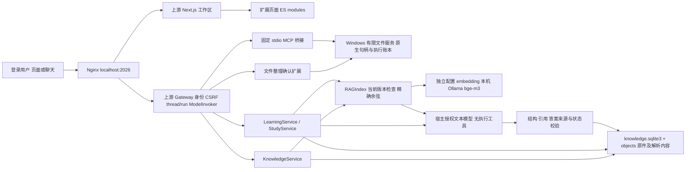

# 个人学习与知识管理助手：实际架构

基于 DeerFlow 二次开发，保留上游许可证、版权及 Git 历史。原有
[ARCHITECTURE.md](ARCHITECTURE.md) 描述上游框架；本文描述个人新增模块，
不把上游 Agent、身份、沙箱、流式聊天或模型运行时计为个人实现。

## 服务和数据流

开发栈有 frontend、gateway、nginx、redis 四个服务。Redis 是上游运行时流桥，
不是新增知识库或学习进度库。Windows 服务和 embedding 服务在 Docker 外；
授权目录不挂入容器。开发栈挂入项目源码与私有运行配置，不能等同于生产隔离部署。

| 个人模块 | 实际代码及职责 |
| --- | --- |
| Windows 文件服务 | `services/local_file_service/`：授权根、reparse/原生句柄边界、有限目录操作、选定导入、持久整理方案、执行和条件撤销 |
| 文件整理扩展 | `backend/file_organization_extension/`：复用宿主页面、session/Origin/CSRF；确认绑定方案版本和摘要，Windows 确认密钥只由本人输入 |
| 知识库 | `backend/knowledge_base_extension/store.py`、`parser.py`：所有权、稳定文档 ID、不可变版本、SHA-256 去重、有限解析、tombstone 和清理 |
| RAG | `rag.py`、`answer.py`：原文定位切分、真实向量、整世代发布、范围检索、当次引用校验、原文入口和来源类型 |
| 学习 | `learning.py`、`learning_models.py`、`feedback.py`：有界计划/讲解、预算、修订、私有答案、客观判分与有限简答参考核对 |
| 笔记错题复习 | `study.py`、`static/study.mjs`：修订草稿、真人入库、不可变重练记录、依赖来源核验、时区日期规则和当日去重 |
| 验收工具 | `demo.py`、`evaluate.py`、`evaluation_review.py`：公开合成文件、固定检索集和显式人工评分汇总；不替真人操作 |

## 一套持久存储与版本关系

知识库卷 `/var/lib/deerflow-knowledge` 保存 `knowledge.sqlite3`、
`objects/<version_id>/original` 和 `parsed.json`；向量、引用定位、失效记录及学习
记录在同一 SQLite。parser 的专用 `python/` 是可重建依赖，不是原资料。

`documents.current_version` 只指向 ready 版本。解析成功的新版本未索引时整库
检索拒绝，不能静默使用旧版本。索引所有批次通过才事务发布，版本失效后清理向量。
查询和引用读取都复核 owner、tombstone、版本、索引配置和世代。

`learning_plans` 及修订、`learning_lessons`、`learning_attempts`、收据和事件记录
关联 thread/run，但独立于聊天生命周期。删除聊天不会删除学习记录。
`study_notes`、笔记修订/入库意图、错题、重练和复习对象/结果复用这个数据库。
准确表名、状态字段以 `learning.py`、`study.py` 的建表代码为准。

笔记版本保存 note ID、批准修订、来源类型和原依据。user_note 与
assistant_confirmed_note 都不是独立证据；原依据变化后笔记副本可保留，但标记
过时，停止使用失效依据评分。讲解和答题历史不因更新被悄悄改写。

## 信任和修改边界

身份来自宿主可信运行上下文，模型不能传其他 user_id。资料正文是低权限数据，
问答/教学模型没有文件工具。结构合法、引用 ID 合法不意味着语义一定正确。

文件执行、知识库更新/删除、笔记入库由真人页面确认。笔记确认路由不是 ModelTool
或普通 backend action；confirmed=true 不构成批准。真人笔记自评、错题收录和
学习完成标记也不能由 Agent 代做。客观题程序判分；简答只提供参考评价，不能
自动宣称掌握。参考答案/rubric 在服务端，作答前的页面和工具投影不包含它们。

修改使用修订号、摘要、幂等收据或原答题关联；同一天复习不重复推进。
文件执行逐项记录意图和实际验证，不能承诺整个批量操作原子性。

## 已实现贡献与边界

个人贡献是上表模块及它们的权限、版本、失效和持久化联动；通用宿主变更限于
非流式内部模型输出隔离/使用统计和可信 ToolContext 的 run/原始人类文字投影。
不是另建一套 Agent 框架，也没有第二套知识库或练习系统。

第一版面向本地个人小规模：PDF/MD/TXT，无 OCR，无联网搜集、外部通知、桌面自动化、
混合检索/重排或跨设备同步。模型文本需人工核对。删除库副本不擦除独立历史文本、
聊天或备份；删除笔记默认保留库副本。生产部署、长期容量和普遍准确率未验证。
当前实测与交付条件见 [ACCEPTANCE.md](ACCEPTANCE.md)。
