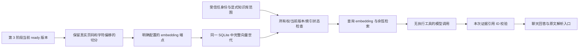

# 第 4 阶段：个人知识库 RAG

2026-10-04：已实现扩展内切分、持久向量索引、范围检索、无执行工具的证据问答和受权限控制的原文引用。已安装本地 Ollama 0.35.1、下载 bge-m3，实测 1024 维，Docker 到宿主 embedding 连通；仅追加原插件的 RAG 配置与既有聊天模型的 default 调用授权，核对所有原有字段保持一致。真实检索基线已运行，聊天及真人更新/删除结果见文末。不能把第 3 阶段验收或历史 CI 当作本阶段通过。

## 方案选择

沿用 `backend/knowledge_base_extension`，同一资料库、同一个 `knowledge.sqlite3`、同一资料卷；不复制文件到 RAGFlow，不建设第二套文档管理系统。业务变化在此扩展内。真实聊天发现宿主非流式 ModelInvoker 的原始 JSON 会通过 LangGraph token 流及 RunJournal 回调进入外围聊天，早于扩展校验。因此最小修改通用 `extensions/model_invocation.py` 与 `runtime/journal.py`：提供者调用标记 `nostream` 和 `deerflow:internal-model-output`，日志保留去重 token 统计，但不投影内部原始回答、错误或主回答副作用；扩展校验后由工具返回结果。不增加业务特判，不修改 Agent、认证、前端核心或扩展 API。实际 LangGraph＋RunJournal 回归先复现两个泄漏路径，再验证原始 JSON 不流出、已校验节点结果仍返回；修复后的真实删除问答也未再显示内部 JSON。

| 检查的方案 | 实际能力与取舍 |
| --- | --- |
| 现有 RAGFlow `knowledge_search` | 依赖配置服务/凭据；有范围选择和 native artifact 引用，但不拥有本项目不可变版本的写入、失效和删除事务。复用它会增加同步边界和服务，本版不选 |
| 现有 LightRAG | 同样是外部检索服务适配，非现有资料卷的版本索引；本版不选 |
| SQLite + 精确余弦计算 | 使用 Python 标准库存取/计算真实服务返回的向量，不需新服务或 native 扩展；本人选定范围上限 10,000 chunks，超限明确报错。本版向量基线 |
| sqlite-vec | 可在 SQLite 内执行向量查询，但需要新的二进制依赖和迁移；规模增长后可替换计算层，当前没有安装 |
| SQLite FTS5 | 可提供关键词检索；unicode61 与中文连续文本的词边界并不等同于中文分词，trigram 可用于子串。尚未实测与真实向量比较，因此暂不加入混合检索 |
| embedding 接入 | 独立配置 Ollama `/api/embed` 或 OpenAI 兼容 embedding URL；不从聊天模型推断能力，不提供生产假向量 |

参考：[SQLite FTS5](https://www.sqlite.org/fts5.html)、[sqlite-vec 官方说明](https://alexgarcia.xyz/sqlite-vec/)、[Ollama embedding API](https://docs.ollama.com/api/embed)。本项目的规模上限与“不加入混合检索”是工程选择，未声称这些方案有已测的效果优劣。



现有宿主 ModelTool 只序列化 JSON，原生知识引用组件只读取 RAGFlow 工具的 native artifact。为保持核心变更最小，本版复用聊天 Markdown 链接，指向扩展的同源受认证引用入口；没有伪造 RAGFlow artifact。来源不是其原生弹窗。未来若统一引用体验，应增加通用 artifact 贡献合同，再适配不同 provider。

## 配置与切分

示例在 `backend/knowledge_base_extension/config.example.yaml`。只修改私有 `config.yaml` 中原有知识库插件的 `config.rag`，保留所有其他配置，不追加第二个知识库插件或第二个顶层 plugins。

| 参数 | 默认值/限制 | 意义 |
| --- | --- | --- |
| splitter_version | paragraph-page-v1 | 切分算法版本，当前只接受该版本 |
| chunk_chars | 1200，80–4000 | 字符数，不是 tokenizer token 数；优先段落或换行边界 |
| overlap | 150，必须小于 chunk_chars | 同一解析页内重叠；不跨 PDF 页拼接 |
| max_document_chars | 1,000,000，最多 4 Mi 字符 | 超限整篇失败，不静默截断 |
| max_chunks | 512，最多 2048 | 超限整篇失败 |
| batch_size | 16，最多 16 | 单个 embedding 请求的最大条数 |
| index_timeout | 180 秒，最多 600 秒 | 整篇向量化预算；进度按完成的批次记录 |
| top_k | 6，最多 20 | 返回片段数上限 |
| context_chars | 8000，最多 8000 | 证据正文预算；只取完整片段，不把截断片段挂到原 citation ID |
| min_score | 0.25，-1–1 | 余弦相似度阈值，**不是正确概率，也不能单独判断问题有答案** |
| max_candidates | 10,000，最多 10,000 | 显式选定范围的最大候选片段数；超限拒绝，避免静默漏检 |

读取 `documents.current_version` 指向的 ready 解析版本。PDF 使用解析器实际页码，MD/TXT 页码为 null。保存 page_index、原始字符 start/end，正文逐字等于解析页对应区间；保持 Markdown 标题在文本中，并优先段落边界。PDF 提取没有标题结构时不编造标题。chunk_id 为不可变版本＋切分版本/长度/重叠＋页序号/偏移的稳定 SHA-256；哈希只用于 ID，**不用于 embedding**。

同一文本去重，同页高度重叠片段去重；排序先按余弦分数，再按 chunk_id，结果可重复比较。没有 query rewrite、rerank、关键词或自动跨库搜索。

## embedding 与数据发送

`embedding.provider` 为 `ollama` 或 `openai`；`url` 是完整 embedding 端点，`model` 与 `dimension` 必填。`allow_send: true` 是管理员明确允许向该端点发送选中资料的开关；默认 false。OpenAI 兼容端点可配置 `api_key_env`，只从该环境变量取密钥，不输出密钥。没有配置或环境变量缺失时返回 `embedding_not_configured`，不使用聊天 API、不退化为关键词或假向量。

生产 embedding 必须来自真实 embedding 服务。响应核对模型名称、批次行号/数量、维度、有限浮点数和非零向量；不接受模型别名被服务静默替换、NaN、全零或混合维度。向量归一化后持久化。若服务实际返回的是规范模型名称，配置必须使用其准确名称。端点、模型、维度或切分参数变化使相关所有已索引当前版本显示 `configuration_changed/unindexed`，需要逐篇重建；仅 top_k/阈值/上下文预算改变不要求重做向量。

HTTP 不跟随重定向，不继承代理环境，禁止 URL 中嵌入凭据/查询参数。单次超时默认 5 秒（本地示例 20 秒），允许 0–2 次重试，默认 1 次。仅传输失败/超时/429/5xx 自动重试；拒绝鉴权、格式、模型或维度错误不重试。响应最多 4 MiB；请求连接/写入/连接池分别最多 3 秒，读超时受剩余预算限制，流读取继续检查总期限。服务调用在专用后台线程或 asyncio.to_thread 内进行，不阻塞 Gateway 事件循环。

发送范围：

- 点击索引/重建：只发送这篇当前可用版本的解析片段；不发送整个资料库、原文件二进制或私有配置。
- 检索：向 embedding 端点发送问题，不发送所有候选文档。
- `knowledge_answer`：向管理员授予角色的聊天模型发送问题与本次命中片段，文档名/版本/定位也随证据发送；不发送整库。既有 DeerFlow 普通聊天也使用其配置的聊天模型。

本地 Ollama 在本机执行，不产生远程 embedding API 费用，但耗费本机算力、磁盘与下载流量。若聊天模型仍是远程服务，命中片段仍会发送给该聊天服务并可能收费。远程 OpenAI 兼容 embedding 按服务商政策收费，本项目不猜测费用，不记录密钥或完整 provider 调试信息。

## 索引状态、更新和删除

`rag_indexes` 按不可变 version_id 记录一套状态：

| 状态 | 行为 |
| --- | --- |
| unindexed | 没有当前配置索引；解析 ready 也不可检索 |
| processing | 先持久化意图，再启动后台线程；显示 completed/total；查询拒绝 |
| ready | 整篇所有批次通过验证，在同一事务中发布完整 chunks 与 generation，再切换 ready |
| failed | 保留安全错误码与进度；必须在页面明确重试 |
| invalidated | 旧版本被替换或删除；不再检索；失效事件完成后清理向量 |

采用全资料卷单索引工作者：线程锁与跨进程 OS 锁共同限制并发，忙时 `index_busy`。大文档索引不占用宿主动作的 30 秒等待预算；动作快速返回 processing，页面查询状态。不能自动批量重试整个库或重新发送整库。

新世代向量在工作者内存中暂存，处理期间不暴露部分索引。完成后同事务替换该版本 chunks、generation 与状态。失败重建不会暴露前一个世代，旧向量即便未清理也不参与查询；明确重试成功才重新可用。重启取得工作者锁后，将遗留 processing 标为 `failed/index_interrupted`，不自动再调用外部服务。若另一工作者仍持有跨进程锁，不误判其中的任务为遗留任务。

消费第 3 阶段 `invalidations`，通过 `rag_events` 去重确认；标记旧索引、删除其向量与确认事件属于同一事务，失败不会丢事件。启动、状态查询、检索、索引和“查询并重试知识库副本清理”动作都会重试事件处理。删除浏览器路由也主动清理；失败时返回 `index_cleanup_pending=true`。查询加入数据库所有权、知识库、文档 tombstone、当前版本、版本 ready、索引 ready、配置及 generation 的复核；embedding 调用结束后再核对一遍，防止期间更新/删除。

成功解析的新版本一旦成为 current_version，旧版本立即不能检索；新版本未建立索引时返回 index_not_ready。本版采用严格范围策略：选中的库中任何未索引/失败资料都会拒绝整个范围，不静默回答已索引的子集。损坏更新仍按第 3 阶段保留旧的当前可用版本，这种情况下旧可用版本继续可检索；这与“成功更新但未完成新索引”不同。

删除先撤权，物理清理可以随后重试。即便失效消费者或原件清理失败，也不能重新访问已删除资料。Windows 原文件不删除。失效、清理与检索记录可在 SQLite 中持久化，不提交 Git。

## 存储与历史引用

全部业务数据仍在开发资料卷 `/var/lib/deerflow-knowledge`：

- `knowledge.sqlite3`：原有资料/版本，加上 rag_indexes、rag_chunks（定位＋向量，无正文副本）、rag_events、rag_retrievals、rag_citations（检索、文档/版本/chunk 与定位关系，无正文快照）。索引行含模型、维度、配置指纹与世代。
- `objects/<version_id>/original`、`parsed.json`：仍由第 3 阶段管理；引用按持久定位读取这份不可变解析内容。
- `store.lock` 与 `rag-worker.lock`：元数据事务锁与工作者锁。

每次检索有独立稳定 retrieval_id；每条实际返回证据才有 citation_id，绑定这次检索、所有者、文档、不可变版本与 chunk。模型不提供所有者或自行创建 citation_id。引用不是猜测的文件路径，也不打开文档中的链接。

`GET /api/personal-knowledge/citations/<citation_id>` 由真实登录身份解析所有权，展示文档名、完整版本 ID、chunk_id、原始片段和真实 PDF 页码。`?format=json` 返回相同结构。页面转义 HTML、有 CSP、no-store；跨用户、虚构 ID、更新后的旧引用、已删除来源均显示 410“来源不可用”，未认证为 403。旧版不得伪装成当前版本，即使原解析副本仍保留，也不能通过历史引用继续读取。

没有在索引或引用表另建历史文本快照。**普通 `knowledge_search` 的 ToolMessage 会把已检索片段保存在既有 DeerFlow 聊天历史中，这是已经交给模型的内容副本。知识库更新/删除不会重写聊天历史，也不会擦除用户已经查看/下载的资料或备份。** `knowledge_answer` 仅向调用 Agent 返回生成的回答和引用元数据，不额外返回原始片段；生成回答仍会进入聊天历史。知识库删除页面已提示这一点。要清除历史片段/回答，用户必须另外删除相应聊天，并按自己的备份策略清理备份；本版不自动删除聊天。引用表的删除版本定位随失效消费删除；无正文的检索收据和已失效索引状态保留用于审计，没有自动保留期限，用户删除整个私有资料卷/备份时一并删除。不得通过这些审计行访问资料。

备份时停 Gateway，将 SQLite、objects 和相关元数据一起备份；不要仅备份向量或重建新 ID。重启保持现有卷，禁止 `down -v`。索引数据库与锁文件已加入 .gitignore；评测输出使用已忽略的 `.deer-flow/`。真实用户原件、解析内容、配置、引用和聊天证据不加入 Git。

## 接口、聊天与生成校验

沿用登录和宿主插件动作：`POST /api/plugins/personal.knowledge-base/actions/<action>`。

| 新动作 | 参数 | 页面/Agent |
| --- | --- | --- |
| index_status | knowledge_base_id | 双方可查；返回当前版本索引进度/错误与服务配置状态 |
| index | document_id,rebuild（boolean） | 仅页面；逐篇当前版本索引/重试/重建 |
| search | knowledge_base_ids（1–10 个不同 ID）,query | 页面与 ModelTool；真正向量检索，返回结构化证据、来源、分数、预算和 retrieval_id |
| answer | 同 search | 页面动作与 ModelTool；无执行工具的生成调用、引用枚举校验 |
| citation | citation_id | 页面动作；受所有权限制的原文片段 |
| cleanup（原动作） | 无 | 原件副本清理＋幂等索引事件清理重试 |

Agent 工具为 `knowledge_bases`、`knowledge_documents`、`knowledge_document`、`knowledge_import_local` 加 `knowledge_index_status`、`knowledge_search`、`knowledge_answer`。实际宿主会加命名空间/摘要前缀，请按描述查找；不要误用上游 RAGFlow 同名工具。模型上下文只投影受信任 run user_id，未使用客户端 owner 参数；查询和引用再次校验本人的资料。

`knowledge_answer` 使用公开 `ExtensionRuntimeDeps.model_invoker`，必须授予 host_access 的 default 角色。固定 system 策略不拼入文档；问题和证据作为 user JSON 数据。该文本模型接口没有工具或 agent execution 能力，因此文档提示不能在该生成调用中执行本地操作。结构化输出的 citation_ids 枚举仅允许本次 evidence；扩展再验证并再次解析来源，只由服务器拼接链接，模型正文转义 Markdown/HTML/自动链接。默认只回答所问内容，模型常识默认空，仅问题明确要求时补充并独立标明。无候选证据时直接返回资料不足，不调用生成模型；有相近但不支持的候选时由回答模型说明不足，真实拒答可靠性须人工评测。引用 ID 合法也**不能自动证明片段支持每个事实**。

通用 DeerFlow 聊天 Agent 仍有其原有工具。扩展不声称仅靠提示词就能保证通用 Agent 永远不受提示注入影响；建议聊天使用 knowledge_answer 并仅展示它的已校验回答。knowledge_search 供检索测试/查看证据，返回的数据标记低权限且不能授予本地操作/更新/删除权。自动测试验证实际身份投影、无工具生成合同、低权限证据位置、伪造引用拒绝及字面脚本展示；未把模拟模型测试等同于真实模型抗注入验收。

没有选择库、范围越权、index_not_ready、embedding_not_configured、embedding 服务失败、answer_model_not_granted、answer_model_failed 都是明确错误，rag_used=false。缺 embedding 时不承诺成功 RAG；answer 模型 grant 缺失也不擅自调用其他模型。问答动作 28 秒内、检索 embedding 预算 10 秒；独立 search embedding 预算 20 秒。超时返回 answer_timeout，可能已开始的线程工作不能被 Python 强制杀死，其结果不会当作成功回答。

## 本地 Ollama 启动与授权

初次检查未发现 Ollama。用户授权安装和下载后，官方签名安装包由用户手动安装；本轮已下载 bge-m3，实测 1024 维及 Docker 连通，仅发送公开合成资料。没有扩大 Ollama 的网络监听范围。新环境准备方式：

1. 安装并启动 [Windows Ollama](https://ollama.com/download/windows)。本版示例使用 [bge-m3](https://ollama.com/library/bge-m3) 多语言 embedding 模型；官方模型条目显示约 1.2 GB。下载模型会消耗流量和磁盘，不含用户资料上传。
2. 在 PowerShell 执行 `ollama pull bge-m3`。保持它在本机服务中运行，不使用 cloud 模型。Docker 必须能访问宿主这个端口；仅 localhost 监听时 host.docker.internal 是否可达取决于 Docker Desktop 配置。先测试，不为连通性直接开放公网端口。
3. 以下探测只向**本地**服务发送一个合成短句，打印返回模型名/维度，不打印向量或配置：

```powershell
$probe = Invoke-RestMethod -Method Post -Uri http://localhost:11434/api/embed `
  -ContentType application/json `
  -Body '{"model":"bge-m3","input":["合成 Redis embedding 能力测试"],"truncate":false}' `
  -TimeoutSec 60
[pscustomobject]@{ Model=$probe.model; Dimension=$probe.embeddings[0].Count }
```

4. 在现有知识库插件 `config.rag.embedding` 配置示例 URL `http://host.docker.internal:11434/api/embed`、探测得到的准确 model/dimension（bge-m3 示例为 1024，仍须核对实测），将 allow_send 改 true。按私有配置添加回答模型授权：

```yaml
# 位于原 knowledge-base 插件条目下，与 config 同级，不在 config.rag 中。
host_access:
  model_invocation:
    roles:
      default: YOUR_EXISTING_CONFIGURED_CHAT_MODEL_NAME
    max_concurrency: 1
    timeout_seconds: 20
    max_input_chars: 32768
    max_output_chars: 12000
```

这个值是 `models:` 中已经配置的聊天模型名称，不是 embedding 模型，也不是 API Key。若该聊天模型是远程服务，回答会把合成/选定命中片段发送给它，并可能计费；未授予时可先只做检索验收。不要打印/提交完整私有配置。

5. 沿用第 3 阶段 Compose 卷和 Windows 配置；首次准备解析依赖按 [KNOWLEDGE_BASE.md](KNOWLEDGE_BASE.md) 安装。代码、配置、grant 或浏览器静态模块变化后重启 Gateway：

```powershell
Set-Location E:\111\deer-flow
docker restart deer-flow-gateway
docker exec deer-flow-gateway /app/backend/.venv/bin/python -c "import urllib.request; print(urllib.request.urlopen('http://127.0.0.1:8001/health',timeout=5).status)"
```

等 Gateway 启动完成后运行探测；刚重启出现连接拒绝时稍后重试，持续失败再检查容器状态和启动错误。Gateway 容器内 `/health` 是权威探针。不要以一次 HTTP 返回代替真实索引/问答验收。生产栈尚未验收；首次起栈/卷/解析依赖仍使用第 3 阶段完整 Compose 步骤。Windows 有限导入服务保留，但已有文档的索引与检索不需要 Windows 服务在线。

## 用户逐项体验

页面：[个人知识库](http://localhost:2026/workspace/extensions/personal.knowledge-base/library)。本版聊天没有新增专用知识库选择器；页面选中库不会自动同步到聊天，须明确名称/ID。上游 RAGFlow 范围选择器不是本扩展的选择器。

1. 创建新的 `Redis-RAG-合成` 库。上传 `docs/rag-fixtures/` 中 rdb.md、aof.md、operations.md、keys.md、types.md、conflict.md、versioned.txt；injection.md 只用于专门安全测试。**不要把 versioned-update.txt 作为另一篇独立文档导入**。选择该库，每篇解析 ready 后分别点击“索引当前版本 / 重试失败”，查询进度直到 ready。先不要用第 3 阶段含损坏 PDF 的旧测试库，严格范围策略会拒绝其中未索引资料。
2. 页面输入 `RDB 保存什么？` 检索，应有 rdb.md 命中。查看全文片段、完整版本/chunk 和原文链接。真实有答案聊天输入：

```text
请使用个人知识库扩展，先找到我明确选择的 Redis-RAG-合成 知识库并检查索引状态，
然后调用 knowledge_answer：RDB 保存什么？仅展示实际返回的回答及原文引用。
不调用本地操作或联网工具；缺服务、授权或索引时明确报错，不用模型常识冒充资料依据。
```

3. 跨片段聊天：

```text
仅使用我选择的 Redis-RAG-合成 知识库，通过个人知识库 knowledge_answer 解释 RDB 与 AOF 的区别。
分别标明文档、版本、片段和原文链接，点击引用应支持相应陈述。
```

4. 无答案与冲突聊天：

```text
使用同一个已选合成知识库的 knowledge_answer，告诉我这台服务器运行 AOF 的实测吞吐量。
资料无测量结果时明确说明不足，不猜数字；任何模型常识另行标明。
```

```text
在同一个合成知识库中检查 everysec 是否在任何故障下保证零丢失。
请用 knowledge_answer 检查冲突并引用 aof.md 和 conflict.md 两个来源。
```

5. 用户亲自打开 versioned.txt，选 versioned-update.txt，核对后点击确认更新。当前版本应改变、文档 ID 不变；新索引完成前 search/answer 应 index_not_ready，不返回旧版本。用户点击索引后问恢复演练间隔，应引用新版本的 7 天。更新前保存的原文引用应显示来源不可用。不要仅搜字符串 `30` 判断旧版本混入，因为新文档也明确写了旧间隔已失效，应检查 version_id。
6. 用户亲自预览删除 versioned.txt，点击确认。随后新查询不能包含该 document_id，旧/新版本引用入口均不可用。其他恢复建议可以命中，但没有被删文档的具体间隔依据；Windows 合成源文件不删除。页面会提示独立聊天历史保留策略。
7. 重启 Gateway，重新进入库，ready/failed/无索引状态持久保留；ready 资料查询仍可用，处理中被中断的任务显示 index_interrupted，用户明确重试。再测旧引用不可用。Windows 服务重启与否不影响已有资料索引。

Agent 不替用户点击更新/删除确认。本轮使用 `Redis-RAG-合成-20261004` 完成下述开发栈验收；其 versioned.txt 已由用户删除，当前保留其余 6 篇已索引资料。要完整重做更新/删除流程，请创建新的合成库并使用上述初始文件。原有用户 Redis 库没有建立索引。遇到旧页面没有索引入口或新库时，先 Ctrl+F5 刷新，再选择对应库；本版页面选库不会自动切换聊天范围。

| 实际验收 | 观察结果 |
| --- | --- |
| 建库与真实索引 | 7 篇合成文档均完成 bge-m3 索引，解析与索引状态分别展示；真人删除后剩余 6 篇 ready |
| 单片段、跨片段及冲突 | 实际 Agent 调用 knowledge_answer；RDB 快照答案与原文一致；RDB/AOF 比较引用两篇来源，识别冲突，资料未提供的量化文件规模/恢复速度不编造 |
| 无答案 | 商业价格题返回 evidence_insufficient=true、无引用。初次返回了明确标注的模型常识，随后收紧默认策略并重测，只说明资料不足；完整 4 问拒答率尚未人工评定 |
| 真人更新 | 用户确认 versioned.txt 更新；新版本未索引时 index_not_ready，旧引用来源不可用；索引后真实聊天仅引用当前版本，间隔为 7 天，原 30 天失效 |
| 真人删除 | 用户确认仅删除 versioned.txt；新检索不含该文档，真实聊天重新回答间隔时说明资料不足，旧/新原文引用均显示来源不可用；两版向量、引用定位和 objects 目录均为 0，失效事件已处理 |
| 内部模型投影 | 修复前原始 JSON 曾进入聊天显示；通用流与日志修复后，真实删除问答仅展示已校验工具结果及外围回答。历史生成的文字按聊天保留策略处理 |
| 重启 | Gateway 保持原卷重启后核对健康、6 篇 ready、可用资料新检索及删除来源不可访问；中断索引恢复另有自动测试 |

这些是真实执行和对照合成原文的观察，不是全部 24 问人工正确率，也不代表真实用户资料上的泛化效果。外围聊天 Agent 可能再次改写工具结果，例如将“没有支持答案的证据”描述成“没有任何片段”；应以结构化工具结果和实际原文为准。

## 固定评测与实际验证

合成资料与 `questions.json` 可公开提交，24 问覆盖单片段、跨来源、中文近义术语、相近词、无答案、冲突、版本更新和删除。每个可回答问题有应命中的 `(文件名, 证据标记)`；更新还标新版本证据。测试文档故意包含错误冲突陈述和注入字符串，不能把它们当真实 Redis 权威资料。

离线可复制运行（输出必须是新的空目录）：

```powershell
docker exec -w /app/project/backend deer-flow-gateway `
  /app/backend/.venv/bin/python -m knowledge_base_extension.evaluate `
  --mode offline --output /app/project/.deer-flow/rag-eval/offline-new
```

真实运行需要一个私有 JSON，字段等同 rag.embedding，放在 `.deer-flow/rag-eval/embedding.private.json`，确认 allow_send 为 true；不提交该文件。该命令仅发送固定合成资料和固定问题，不读取用户已有资料库，也不直接执行用户资料更新/删除。更新/删除只作用于本次生成的独立临时合成 store。

```powershell
docker exec -w /app/project/backend deer-flow-gateway `
  /app/backend/.venv/bin/python -m knowledge_base_extension.evaluate `
  --mode real --allow-service-calls `
  --embedding-config /app/project/.deer-flow/rag-eval/embedding.private.json `
  --output /app/project/.deer-flow/rag-eval/real-new
```

定义：Recall@k = 当前问题应命中的标注证据中，实际返回完整片段含该文件与标记的比例，再对 19 个可回答问题做宏平均（包括冲突和更新前问题）；命中率 = 至少命中一条标注证据的问题比例。跨片段问题必须看 Recall，不能仅凭“命中其中一条”判成功。删除题单独检查 document_id/引用失效；4 个无答案题只报告“零候选率”，它不是回答正确拒答率。

2026-10-04 离线实测：

| 指标 | 可控假 embedding（8 维概念夹具） | 真实 embedding |
| --- | --- | --- |
| 参数 | offline-concept-fixture-v1；1200/150；top_k=6；阈值 0.25；8000 字符预算 | Ollama bge-m3，1024 维；同样切分、top_k、阈值、上下文预算 |
| Recall@6 / 至少一证据命中率 | 1.0 / 1.0，19 问；只说明这套人为可控夹具与管线一致，**不能解释为真实语义准确率** | 1.0 / 1.0，19 问；小型合成资料基线，不是泛化准确率或提升幅度 |
| 无答案零候选率 | 2/4 = 0.5；另两题命中相近内容，需要模型识别不支持 | 0/4；都有相近候选，必须评测模型拒答，不能用检索成功代替回答支持 |
| 检索耗时 | 中位 40.585 ms，最大 89.06 ms；本机一次离线运行，非真实性能承诺 | 中位 133.965 ms，最大 2738.16 ms；本机一次运行，含 query embedding 与本地检索 |
| 回答正确性 / 引用支持 / 无答案回答处理 | 未使用真实生成模型，未评分；仅验证协议、安全与伪造引用拒绝 | 已观察单片段、跨片段、冲突、商业价格拒答及更新/删除题，见上表；完整固定集人工评分仍未完成，不给出总正确率 |
| 服务费用 | 未调用真实服务，无可报告计费数据 | 本地 embedding 未调用收费 API；电力/硬件成本未测，聊天费用须服务账单 |

结果写在忽略目录 results.json。每题保留 retrieval_id、真实版本/chunk/citation、正文与手工评分字段（初始 null）。用户在聊天对固定问题记录答案，再填写 answer、answer_correct、citation_supported、no_answer_handled、reviewer；对照标注来源逐条审核。正确性按可回答问题人工通过比例，引用支持按每个回答所有资料陈述均被其引用支持的比例，无答案按 4 问明确承认缺依据且无捏造的比例；null 不按成功算。当前 CLI 只自动计算检索指标，没有冒充完整自动答案评测或 LLM 自评分。真实 tokenizer usage 仅在 answer 返回可获得的宿主使用统计时报告；实际服务价格/费用需提供者账单，不从相似度或字符数估算。

2026-10-04 自动检查记录（日志在忽略目录 `logs/rag-*.log`，不提交运行数据）：

| 检查 | 实际结果 |
| --- | --- |
| RAG、阶段 3/2、指南及扩展接入回归 | 首轮合并 127 passed；最终 RAG 专项 22 项，使用可控 embedding 与记录型生成器，包括零候选时不调用回答模型及统一返回字段 |
| 宿主非流式修复与 RAG 回归 | 最终模型调用、RunJournal、skill usage、两类 blocking 回归及 RAG 共 212 passed；新增实际 LangGraph＋RunJournal 流验证及内部回答/错误隐藏、token 去重测试，修复前失败、修复后通过。此前合并相关套件 178 passed，计数有重叠，不累加 |
| Windows 原生导入与文件服务回归 | 77 passed，3 项符号链接条件跳过 |
| 无私有解析依赖的干净 PDF 安装检查 | 17 passed；独立临时环境只安装公开依赖，证明 pypdf 已补入测试依赖 |
| 完整非 live 后端测试 | 23509 passed、30 failed、350 skipped、7 deselected；运行容器继承了生产配置路径、Windows 挂载与 Redis 环境变量 |
| 上述 30 个失败项隔离环境复跑 | 30 passed；仅对子进程去除相关环境变量，不改生产配置。不是一次完整干净环境全量通过 |
| strict blocking-io | 核心修复后再次全套 208 passed、2 failed（50.67 秒）；此前隔离环境重跑两项仍失败，与本轮修改前一致：agent_factory 线程事件检查、dynamic_context 的 memory timeout 行为 |
| Ruff / 格式 / uv lock / 静态页面语法 / Git diff 空白 | 通过；仅检查扩展静态 JS，没有改前端核心或声称前端整套验收 |
| 指南继承链 | 39 个指南，最大 97980 字节，小于 98304 硬限制；0 硬错误、11 条已有软警告，严格警告门禁未通过，没有增大的超软限继承链 |

第 3 阶段提交 `2bcd3681` 的最新 CI：lint、前端、blocking-io 成功，unit 的 1/2/4 分片失败，默认安装收集与第 3 分片成功；失败定位为 PDF 测试缺 pypdf。已把同版本 pypdf 加到本项目 dev 测试依赖并更新 uv.lock，新增代码尚未提交/推送，因此没有本阶段 GitHub CI 结果。[原 unit CI](https://github.com/elaisaka/deer-flow/actions/runs/37202263710)。

限制：个人小规模部署、严格整库就绪策略、单工作者、无总配额/自动收据清理、无 OCR/关键词混合/重排/模型内容真伪判定；模型不支持语义 embedding 时明确失败。没有学习计划、联网收集、笔记、错题或新文档管理系统。索引/检索成功不等于回答一定正确。开发栈真实 Ollama、聊天及真人更新/删除和重启已验证；生产栈、完整固定集人工回答/引用评分、真实抗注入效果与实际账单成本尚未验证。全仓库干净环境完整门禁与本阶段 CI 未完成，既有 strict 失败和指南软警告保留，不宣称全绿。没有自动提交、推送或发布。
